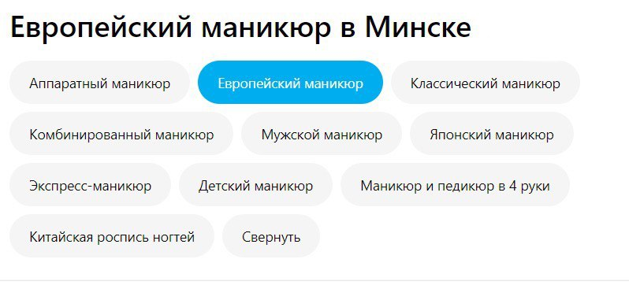

# Требования к проекту

## Содержание

[1 Введение](#1-введение)  
[1.1 Назначение](#11-назначение)  
[1.2 Бизнес-требования](#12-бизнес-требования)  
[1.2.1 Исходные данные](#121-исходные-данные)  
[1.2.2 Возможности бизнеса](#122-возможности-бизнеса)  
[1.2.3 Границы проекта](#123-границы-проекта)  
[1.3 Аналоги](#13-аналоги)  
[2 Требования пользователя](#2-требования-пользователя)  
[2.1 Программные интерфейсы](#21-программные-интерфейсы)  
[2.2 Интерфейс пользователя](#22-интерфейс-пользователя)  
[2.3 Характеристики пользователей](#23-характеристики-пользователей)  
[2.3.1 Классы пользователей](#231-классы-пользователей)  
[2.3.2 Аудитория приложения](#232-аудитория-приложения)  
[2.3.2.1 Целевая аудитория](#2321-целевая-аудитория)  
[2.3.2.1 Побочная аудитория](#2322-побочная-аудитория)  
[2.4 Предположения и зависимости](#24-предположения-и-зависимости)  
[3 Системные требования](#3-системные-требования)  
[3.1 Функциональные требования](#31-функциональные-требования)  
[3.1.1 Основные функции](#311-основные-функции)  
[3.1.1.1 Поиск салонов (главое-меню)](#3111-поиск-салонов-(главое-меню))  
[3.1.1.2 Поиск салонов (окно выбора)](#3112-поиск-салонов-(окно-выбора))  
[3.1.2 Ограничения и исключения](#312-ограничения-и-исключения)  
[3.2 Нефункциональные требования](#32-нефункциональные-требования)  
[3.2.1 Атрибуты качества](#321-атрибуты-качества)  
[3.2.1.1 Требования к удобству использования](#3211-требования-к-удобству-использования)  
[3.2.1.2 Требования к безопасности](#3212-требования-к-безопасности)  
[3.2.2 Внешние интерфейсы](#322-внешние-интерфейсы)  
[3.2.3 Ограничения](#323-ограничения)

# 1 Введение

## 1.1 Назначение

В этом документе описаны функциональные и нефункциональные требования к веб-приложению Салона ноготочков. Этот документ 
предназначен для команды, которая будет реализовывать и проверять корректность работы приложения.

## 1.2 Бизнес-требования

### 1.2.1 Исходные данные

Большое количество людей разной возрастной категории ежедневно пользуются различными салонами, где им предоставляются услуги по маникюру.
Разумеется все мы всегда хотим получить наивысший уровень услуг за заплаченные нами деньги. 

### 1.2.2 Возможности бизнеса

Многие люди разумеется для их же удобства хотят иметь сервис, который позволит получать нужную информацию по данной теме, выбриать дату и
время для записи к конкретному мастеру, руководствуясь ценами для различных мастеров, затрачивая по минимуму время и силы.
Интерфейс, спроектированный так, чтоб пользователю было легко и просто получить желаемое, не затрачивая лишних средств.

### 1.2.3 Границы проекта

Сервис по салону наготочков позволит зарегистрированным пользователям найти нужных мастеров и выбрать необходимые даты для записи на прием.
Поиск нужных мастеров по всем салонам, либо же выбор самого салона. Принцип простой:

1.Пользователь заходит на сайт, выбирает нужный салон ноготочков(или мастера).

2.Сервис в реальном времени запрашивает информацию по салонам(или мастерам) в выбранном городе.

3.Все собранные варианты отображаются на одной странице, начиная от самых дешевых.

4.Пользователь выбирает подходящее место, мастера далее он выбирает дату и время.

## 1.3 Аналоги

Обзор аналогов представлен в документе [analogues](analogues.md).

# 2 Требования пользователя

Информация о салонах и мастерах будет браться из различных сервисов и источников.

## 2.1 Программные интерфейсы

Главное меню приложения:  

  

Поиск салонов:  

  

## 2.3 Характеристики пользователей

### 2.3.1 Классы пользователей

| Класс пользователей | Описание                                                                                              |
|:--------------------|:------------------------------------------------------------------------------------------------------|
| Без доступа к сети  | Пользователи, не имеют доступ к сервису.							      |
| С доступом к сети   | Пользователи, которые имеют доступ к сети. Имеют доступ к полному функционалу                         |

### 2.3.2 Аудитория приложения

#### 2.3.2.1 Целевая аудитория

Люди любой возрастной категории, обладающие минимальными навыками работы с ПК и в сети интернет, интересующиеся записью на примем в салон ноготочков.

#### 2.3.2.2 Побочная аудитория

Люди которые занимаются в сфере бизнеса, заинтересованные в заработке на потенциальных клиентах салонов.

## 2.4 Предположения и зависимости

Сервис не работает при отсутствии подключения к Интернету;

# 3 Системные требования

## 3.1 Функциональные требования

### 3.1.1 Основные функции

#### 3.1.1.1 Поиск салонов (главное меню)

**Описание:** Пользователь имеет возможность поиска и сравнения нужных салонов.

| Функция                              | Требования                                                                                                                                                                                                                                                                                               | 
|:-------------------------------------|:---------------------------------------------------------------------------------------------------------------------------------------------------------------------------------------------------------------------------------------------------------------------------------------------------------|
| Выбор вида маникюра              | Приложение предоставляет на выбор вида маникюра который вы желаете       
                                                                                                                                                            		  
| Выбор покрытия ногтей.           | Приложение предоставляет на выбор тип покрытия ногтей который вы хотите
                                                                                                                                                                                 				              		  
| Выбор наращивания ногтей		   | Выбирается тип наращивания ногтей
                                                                                                                                                 										  
| Выбор дизайна ногтей             | Выбирается необходимый дизайн ногтей
																										  
| Выбор укрепления ногтей          | Выбираем нужный тип укрепления ногтей         
                   																									  

#### 3.1.1.2 Поиск салонов (окно выбора)

**Описание:** Пользователь имеет возможность сравнения и выбора нужного вида процедуры.

| Функция                              | Требования                                                                                                                                                                                                                                                                                               | 
|:-------------------------------------|:---------------------------------------------------------------------------------------------------------------------------------------------------------------------------------------------------------------------------------------------------------------------------------------------------------|
|Сравнение и выбор нужного вида маникюра              | Приложение предоставляет на выбор вида маникюра который вы желаете       
                                                                                                                                                            		  
|Сравнение и выбор нужного покрытия ногтей.           | Приложение предоставляет на выбор тип покрытия ногтей который вы хотите
                                                                                                                                                                                 				              		  
|Сравнение и выбор нужного вида наращивания ногтей		   | Выбирается тип наращивания ногтей
                                                                                                                                                 										  
|Сравнение и выбор дизайна ногтей             | Выбирается необходимый дизайн ногтей
																										  
|Сравнение и выбор укрепления ногтей          | Выбираем нужный тип укрепления ногтей    
   																												  

### 3.1.2 Ограничения и исключения

Приложение функционирует только при наличии подключения к Интернету;

## 3.2 Нефункциональные требования

### 3.2.1 Атрибуты качества

#### 3.2.1.1 Требования к удобству использования

1. Интерфейс удобный для пользования

2. Функциональные элементы не перегружают экран;

#### 3.2.1.2 Требования к безопасности

Для совершения покупок требуется
предпринять дополнительные меры безопасности во избежание потери денежных средств.

### 3.2.2 Внешние интерфейсы

Окна приложения удобны для долгосрочного использования пользователями:

* функциональные элементы не утомляют глаза.
* стандартная цветовая палитра не утомляет глаза.

### 3.2.3 Ограничения

Приложение реализовано на Python/Tornado    																												  
